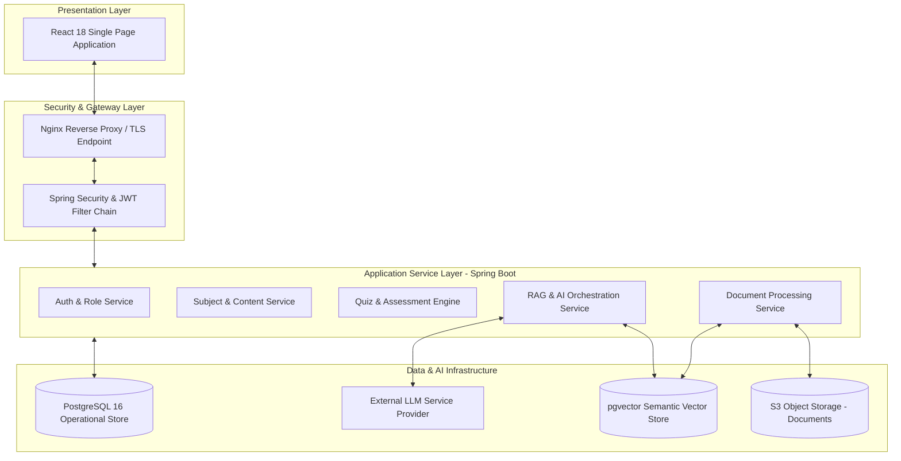
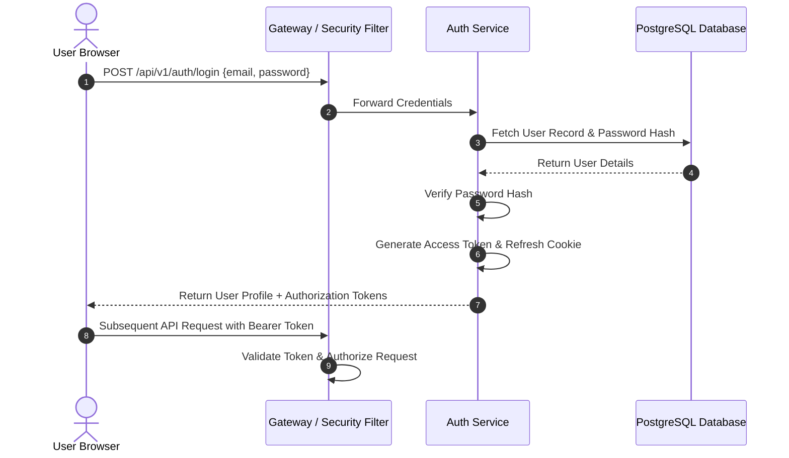
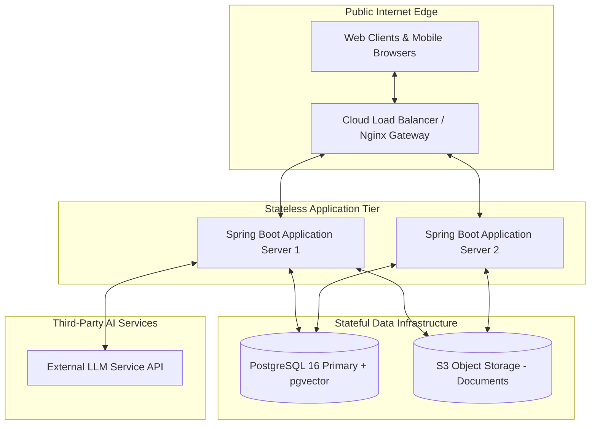
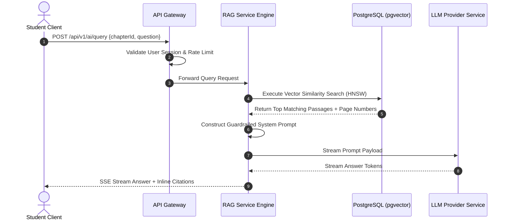

# DOCUMENT 2: HIGH LEVEL DESIGN (HLD)

* **Document Title**: High Level Design (HLD) Specification — LearnPulse AI
* **Document Version**: 1.0.0-FINAL
* **Status**: Approved for Technical Implementation
* **Target Audience**: Solution Architects, Backend/Frontend Engineers, Systems Administrators

---

## 1. System Architecture Overview

LearnPulse AI adopts a **clean, layered architecture** separating presentation, API security, application services, and stateful storage tiers.



---

## 2. Core System Components

1. **React SPA Client**: Delivers an interactive user workspace for students, teachers, and administrators. Communicates via REST APIs and Server-Sent Events (SSE).
2. **Security Gateway**: Nginx terminates TLS connections, routes API traffic, and enforces gateway rate limits. Spring Security validates access tokens and role privileges.
3. **Spring Boot Core Services**:
   * *Auth Service*: Manages user credentials, token issuance, and password security.
   * *Content Service*: Manages subjects, chapters, notes, and file metadata.
   * *Document Ingestion Service*: Parses uploaded PDFs, extracts text passages, and generates semantic vectors.
   * *Quiz Engine*: Controls assessment creation, timers, submission grading, and score persistence.
   * *RAG Engine*: Manages vector similarity searches, prompt construction, safety guardrails, and streaming AI responses.
4. **Data Infrastructure**:
   * *PostgreSQL 16*: Manages relational data (users, courses, quizzes, attempts).
   * *`pgvector` Extension*: Stores semantic passage vectors natively within PostgreSQL, enabling fast vector searches alongside relational data.
   * *S3 Object Storage*: Cloud storage for uploaded PDF study materials.
   * *LLM Provider Gateway*: Interface for vector embedding generation and streaming text completion.

---

## 3. Layered Architecture Deep Dive

```
+-----------------------------------------------------------------------------------+
|                           LEARNPULSE AI LAYER RESPONSIBILITIES                    |
+-----------------------------------------------------------------------------------+
| 1. PRESENTATION LAYER     | React 18 SPA, UI Components, SSE Streaming Client     |
| 2. SECURITY GATEWAY LAYER | TLS 1.3, Nginx Reverse Proxy, Spring Security Filter |
| 3. SERVICE APPLICATION    | Spring Boot Services, Ingestion Engine, Quiz Engine   |
| 4. DATA STORAGE LAYER     | PostgreSQL 16, pgvector Store, S3 Cloud Storage       |
| 5. AI INTEGRATION LAYER   | Semantic Embedding Model, Large Language Model        |
+-----------------------------------------------------------------------------------+
```

---

## 4. Module Breakdown & Responsibilities

| Module | Responsibilities | Dependencies | Data Managed |
| :--- | :--- | :--- | :--- |
| **Authentication** | User login, token issuance, session checks | User Service | `users`, `refresh_tokens` |
| **Student Portal** | Course reading, study tools, progress tracking | Content, Quiz, AI Tutor | `student_progress` |
| **Teacher Portal** | Course creation, PDF uploads, quiz authoring | Content, Ingestion, Analytics| `subjects`, `chapters`, `notes` |
| **Admin Portal** | Account provisioning, subject allocations | User Service, Audit Service | `users`, `audit_logs` |
| **Content Management**| Structuring subjects, chapters, notes, and files | S3 Storage, Ingestion Svc | `notes`, `documents` |
| **Document Ingestion**| PDF text extraction, passage chunking, vectors | Content, `pgvector` | `document_chunks`, `embeddings`|
| **Quiz Engine** | Timed assessments, answer evaluation, scoring | Student, Teacher | `quizzes`, `quiz_attempts` |
| **AI Tutor (RAG)** | Passage retrieval, prompt assembly, streaming Q&A | `pgvector`, LLM Gateway | `ai_conversations`, `messages` |

---

## 5. Component Interaction & Communication Protocols

* **Client $\leftrightarrow$ Gateway**: Secure HTTPS REST endpoints for standard data operations; Server-Sent Events (SSE) for low-latency streaming AI chat completions.
* **Backend Services $\leftrightarrow$ Database**: PostgreSQL connection pool (HikariCP) handling transactional queries and vector similarity searches.
* **Backend Services $\leftrightarrow$ Object Storage**: S3 API protocol for secure file uploads and presigned link generation.
* **Backend Services $\leftrightarrow$ LLM Provider**: Secure HTTPS API requests for embedding generation and completions.

---

## 6. Storage Strategy

> [!TIP]
> **Unified Database Strategy**: Using PostgreSQL with `pgvector` allows operational data (users, courses, quizzes) and vector embeddings to reside within the same database engine. This eliminates the need to synchronize separate relational and vector databases.

```
       +---------------------------------------------------------------------+
       |                       STORAGE ARCHITECTURE                          |
       +---------------------------------------------------------------------+
                                          |
             +----------------------------+----------------------------+
             |                                                         |
             v                                                         v
  [ PostgreSQL 16 Database ]                                [ Cloud Object Storage ]
  - Relational Tables (Users, Courses, Quizzes)             - Uploaded PDF Study Files
  - Native pgvector Store (Passage Embeddings)             - Temporary 15-Min Access Links
  - Transactional ACID Operations                           - Durable Blob Storage
```

---

## 7. AI Subsystem Integration Overview

The AI integration follows a **Retrieval-Augmented Generation (RAG)** workflow:
1. **Passage Retrieval**: When a student asks a question, the backend queries `pgvector` for the top matching document passages from that chapter.
2. **Context Injection**: Retrieved passages are combined with safety guardrails into a structured system prompt.
3. **Grounded Completion**: The prompt is sent to the LLM, which streams back a response containing explicit page citations.

---

## 8. Authentication & Session Flow



---

## 9. Deployment Architecture & Infrastructure Topology



---

## 10. High-Level System Sequence Diagram



---

## 11. Technology Stack Specification

| Component | Selected Technology | Role & Justification |
| :--- | :--- | :--- |
| **Frontend SPA** | React 18 & TypeScript | Component-based UI with compile-time type safety |
| **Backend Framework**| Spring Boot 3.x (Java 21)| Enterprise service execution and REST API management |
| **Database Engine** | PostgreSQL 16 | Relational operational data storage with ACID guarantees |
| **Vector Search** | `pgvector` Extension | Native vector search integrated inside PostgreSQL |
| **Object Storage** | AWS S3 / MinIO | Scalable, durable storage for uploaded PDF study materials |
| **AI / RAG Pipeline**| Large Language Model | Passage embedding and grounded answer generation |
