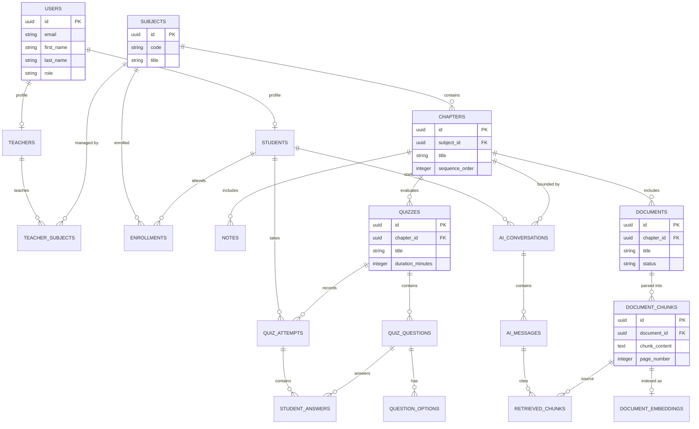

# DOCUMENT 3: DATABASE DESIGN DOCUMENT

* **Document Title**: Relational & Vector Database Design Document — LearnPulse AI
* **Document Version**: 1.0.0-FINAL
* **Status**: Approved for Database Migration Scripting
* **Target Audience**: Database Administrators, Backend Engineers, Data Engineers

---

## 1. Database Architecture Overview

The LearnPulse AI database is built on **PostgreSQL 16**, augmented by the native **`pgvector`** extension. This single-database architecture manages structured operational data (users, courses, quizzes) alongside high-dimensional vector embeddings within a unified, transactional storage engine.

---

## 2. Entity List & Domain Categorization

```
+-----------------------------------------------------------------------------------+
|                        LEARNPULSE AI DATABASE ENTITIES                            |
+-------------------+-------------------+-------------------+-----------------------+
|  AUTHENTICATION   |     LEARNING      |      CONTENT      |      ASSESSMENT       |
|  - users          |  - students       |  - notes          |  - quizzes            |
|  - refresh_tokens |  - teachers       |  - documents      |  - quiz_questions     |
|  - audit_logs     |  - subjects       |  - doc_chunks     |  - question_options   |
|                   |  - chapters       |  - embeddings     |  - quiz_attempts      |
|                   |  - enrollments    |                   |  - student_answers    |
+-------------------+-------------------+-------------------+-----------------------+
|        AI & CONTEXTUAL RAG            |             ADMINISTRATION                |
|  - ai_conversations                   |  - teacher_subjects                       |
|  - ai_messages                        |  - system_settings                        |
|  - retrieved_chunks                   |  - student_progress                       |
+---------------------------------------+-------------------------------------------+
```

---

## 3. Entity Descriptions

* **`users`**: Central account identity store for all platform users.
* **`students`**: Academic profile extensions for student users.
* **`teachers`**: Faculty profile extensions for instructors.
* **`subjects`**: Master record of academic courses.
* **`chapters`**: Sequential modules constituting a subject's syllabus.
* **`notes`**: Rich-text lecture notes published by instructors.
* **`documents`**: Metadata for uploaded PDF study files.
* **`document_chunks`**: Segmented text passages extracted from PDFs for semantic retrieval.
* **`document_embeddings`**: High-dimensional vector store enabled by `pgvector`.
* **`quizzes`**: Assessment configurations associated with course chapters.
* **`quiz_questions`**: Questions defining an assessment.
* **`question_options`**: Multiple-choice options for assessment questions.
* **`quiz_attempts`**: Records of student assessment executions and final grades.
* **`student_answers`**: Audit record of individual answers submitted during an attempt.
* **`student_progress`**: Reading and completion tracking per student per chapter.
* **`ai_conversations`**: Context-bounded AI chat sessions.
* **`ai_messages`**: Individual messages within an AI conversation.
* **`retrieved_chunks`**: Audit table mapping AI messages to exact document citations.

---

## 4. Complete Entity Relationship Diagram (ERD)



---

## 5. Core Database Schema Tables

### 5.1 Identity & User Domain Tables

#### Table: `users`
* **Purpose**: Primary identity record for all platform users.

| Column | Data Type | Key / Constraints | Description |
| :--- | :--- | :--- | :--- |
| `id` | `UUID` | `PRIMARY KEY` | Unique user identifier |
| `email` | `VARCHAR(255)` | `NOT NULL, UNIQUE` | User email address (login identifier) |
| `password_hash` | `VARCHAR(255)` | `NOT NULL` | Encrypted password hash |
| `first_name` | `VARCHAR(100)` | `NOT NULL` | Given name |
| `last_name` | `VARCHAR(100)` | `NOT NULL` | Surname |
| `role` | `VARCHAR(20)` | `NOT NULL` | Role: `'STUDENT'`, `'TEACHER'`, `'ADMIN'` |
| `is_active` | `BOOLEAN` | `NOT NULL` | Account active toggle |

#### Table: `students`
* **Purpose**: Extended academic profile for student users.

| Column | Data Type | Key / Constraints | Description |
| :--- | :--- | :--- | :--- |
| `id` | `UUID` | `PRIMARY KEY` | Profile ID |
| `user_id` | `UUID` | `FOREIGN KEY -> users(id)` | Linked user account |
| `enrollment_number`| `VARCHAR(50)` | `NOT NULL, UNIQUE` | Institutional student ID |
| `academic_year` | `VARCHAR(20)` | `NOT NULL` | Current academic year |

#### Table: `teachers`
* **Purpose**: Extended profile for faculty members.

| Column | Data Type | Key / Constraints | Description |
| :--- | :--- | :--- | :--- |
| `id` | `UUID` | `PRIMARY KEY` | Profile ID |
| `user_id` | `UUID` | `FOREIGN KEY -> users(id)` | Linked user account |
| `department` | `VARCHAR(100)` | `NOT NULL` | Academic department |
| `qualification` | `VARCHAR(100)` | `NULL` | Faculty qualification |

---

### 5.2 Course Content Domain Tables

#### Table: `subjects`
* **Purpose**: Master record of academic courses.

| Column | Data Type | Key / Constraints | Description |
| :--- | :--- | :--- | :--- |
| `id` | `UUID` | `PRIMARY KEY` | Subject ID |
| `code` | `VARCHAR(20)` | `NOT NULL, UNIQUE` | Course code (e.g. "CS-401") |
| `title` | `VARCHAR(200)` | `NOT NULL` | Course title |
| `description` | `TEXT` | `NULL` | Detailed course overview |
| `is_active` | `BOOLEAN` | `NOT NULL` | Subject availability toggle |

#### Table: `chapters`
* **Purpose**: Sequential modules constituting a subject syllabus.

| Column | Data Type | Key / Constraints | Description |
| :--- | :--- | :--- | :--- |
| `id` | `UUID` | `PRIMARY KEY` | Chapter ID |
| `subject_id` | `UUID` | `FOREIGN KEY -> subjects(id)` | Parent subject |
| `title` | `VARCHAR(200)` | `NOT NULL` | Chapter header |
| `sequence_order` | `INTEGER` | `NOT NULL` | Position in syllabus |

#### Table: `notes`
* **Purpose**: Rich-text lecture notes published by instructors.

| Column | Data Type | Key / Constraints | Description |
| :--- | :--- | :--- | :--- |
| `id` | `UUID` | `PRIMARY KEY` | Note ID |
| `chapter_id` | `UUID` | `FOREIGN KEY -> chapters(id)` | Parent chapter |
| `title` | `VARCHAR(200)` | `NOT NULL` | Note title |
| `content_html` | `TEXT` | `NOT NULL` | Formatted note content |

#### Table: `documents`
* **Purpose**: Metadata for uploaded PDF study files.

| Column | Data Type | Key / Constraints | Description |
| :--- | :--- | :--- | :--- |
| `id` | `UUID` | `PRIMARY KEY` | Document ID |
| `chapter_id` | `UUID` | `FOREIGN KEY -> chapters(id)` | Parent chapter |
| `title` | `VARCHAR(255)` | `NOT NULL` | Original filename |
| `file_key` | `VARCHAR(500)` | `NOT NULL` | Object storage key |
| `status` | `VARCHAR(20)` | `NOT NULL` | Status: `'PENDING'`, `'READY'`, `'FAILED'` |

#### Table: `document_chunks`
* **Purpose**: Segmented passages extracted from PDFs for semantic retrieval.

| Column | Data Type | Key / Constraints | Description |
| :--- | :--- | :--- | :--- |
| `id` | `UUID` | `PRIMARY KEY` | Chunk ID |
| `document_id` | `UUID` | `FOREIGN KEY -> documents(id)`| Parent document |
| `chunk_index` | `INTEGER` | `NOT NULL` | Passage index |
| `chunk_content` | `TEXT` | `NOT NULL` | Extracted passage text |
| `page_number` | `INTEGER` | `NULL` | Source page number |

#### Table: `document_embeddings`
* **Purpose**: High-dimensional vector store enabled by `pgvector`.

| Column | Data Type | Key / Constraints | Description |
| :--- | :--- | :--- | :--- |
| `id` | `UUID` | `PRIMARY KEY` | Embedding ID |
| `chunk_id` | `UUID` | `FOREIGN KEY -> document_chunks(id)`| Parent passage chunk |
| `embedding` | `vector(1536)` | `NOT NULL` | Semantic vector array |

---

### 5.3 Assessment Domain Tables

#### Table: `quizzes`
* **Purpose**: Chapter assessment configurations.

| Column | Data Type | Key / Constraints | Description |
| :--- | :--- | :--- | :--- |
| `id` | `UUID` | `PRIMARY KEY` | Quiz ID |
| `chapter_id` | `UUID` | `FOREIGN KEY -> chapters(id)` | Parent chapter |
| `title` | `VARCHAR(200)` | `NOT NULL` | Quiz title |
| `duration_minutes`| `INTEGER` | `NOT NULL` | Allowed time limit |
| `passing_score` | `INTEGER` | `NOT NULL` | Pass threshold percentage |

#### Table: `quiz_questions`
* **Purpose**: Individual questions defining an assessment.

| Column | Data Type | Key / Constraints | Description |
| :--- | :--- | :--- | :--- |
| `id` | `UUID` | `PRIMARY KEY` | Question ID |
| `quiz_id` | `UUID` | `FOREIGN KEY -> quizzes(id)` | Parent quiz |
| `question_text` | `TEXT` | `NOT NULL` | Question statement |
| `question_type` | `VARCHAR(20)` | `NOT NULL` | Type: `'MCQ'`, `'TRUE_FALSE'` |
| `points` | `INTEGER` | `NOT NULL` | Score value |

#### Table: `question_options`
* **Purpose**: Multiple-choice options for assessment questions.

| Column | Data Type | Key / Constraints | Description |
| :--- | :--- | :--- | :--- |
| `id` | `UUID` | `PRIMARY KEY` | Option ID |
| `question_id` | `UUID` | `FOREIGN KEY -> quiz_questions(id)`| Parent question |
| `option_text` | `TEXT` | `NOT NULL` | Display option text |
| `is_correct` | `BOOLEAN` | `NOT NULL` | Correct answer flag |

#### Table: `quiz_attempts`
* **Purpose**: Student assessment executions and final grades.

| Column | Data Type | Key / Constraints | Description |
| :--- | :--- | :--- | :--- |
| `id` | `UUID` | `PRIMARY KEY` | Attempt ID |
| `quiz_id` | `UUID` | `FOREIGN KEY -> quizzes(id)` | Parent quiz |
| `student_id` | `UUID` | `FOREIGN KEY -> students(id)` | Student taking attempt |
| `score_percentage`| `NUMERIC(5,2)` | `NULL` | Final calculated score |
| `status` | `VARCHAR(20)` | `NOT NULL` | Status: `'IN_PROGRESS'`, `'SUBMITTED'` |

---

### 5.4 AI & Context Domain Tables

#### Table: `ai_conversations`
* **Purpose**: Context-bounded AI study chat sessions.

| Column | Data Type | Key / Constraints | Description |
| :--- | :--- | :--- | :--- |
| `id` | `UUID` | `PRIMARY KEY` | Conversation ID |
| `student_id` | `UUID` | `FOREIGN KEY -> students(id)` | Owning student |
| `chapter_id` | `UUID` | `FOREIGN KEY -> chapters(id)` | Bounding course chapter |
| `title` | `VARCHAR(200)` | `NOT NULL` | Session title |

#### Table: `ai_messages`
* **Purpose**: Individual messages within an AI conversation.

| Column | Data Type | Key / Constraints | Description |
| :--- | :--- | :--- | :--- |
| `id` | `UUID` | `PRIMARY KEY` | Message ID |
| `conversation_id`| `UUID` | `FOREIGN KEY -> ai_conversations(id)`| Parent session |
| `sender_type` | `VARCHAR(10)` | `NOT NULL` | Sender: `'USER'`, `'ASSISTANT'` |
| `message_text` | `TEXT` | `NOT NULL` | Message body |

#### Table: `retrieved_chunks`
* **Purpose**: Citation map linking AI answers to retrieved source passages.

| Column | Data Type | Key / Constraints | Description |
| :--- | :--- | :--- | :--- |
| `id` | `UUID` | `PRIMARY KEY` | Map ID |
| `message_id` | `UUID` | `FOREIGN KEY -> ai_messages(id)` | AI assistant message |
| `chunk_id` | `UUID` | `FOREIGN KEY -> document_chunks(id)`| Retrieved source passage |
| `similarity_score`| `NUMERIC(5,4)` | `NOT NULL` | Vector similarity score |
