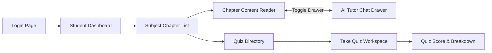
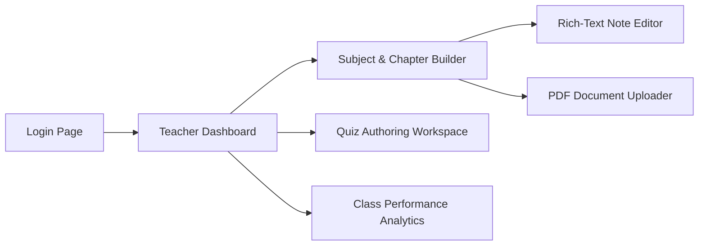
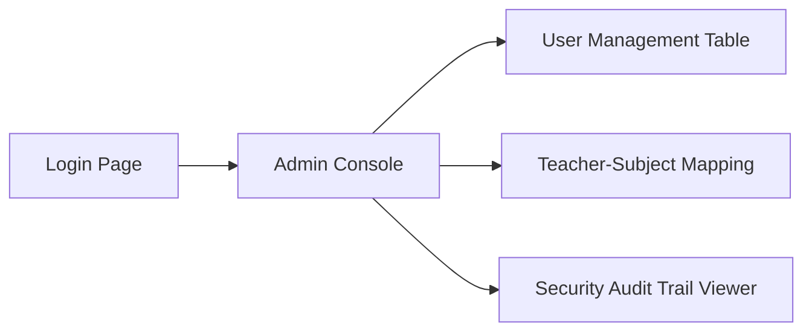

# DOCUMENT 4: FRONTEND DESIGN DOCUMENT

* **Document Title**: Frontend Information Architecture & Navigation Design — LearnPulse AI
* **Document Version**: 1.0.0-FINAL
* **Status**: Approved for UI/UX Development
* **Target Audience**: Frontend Engineers, UI/UX Designers, Product Managers

---

## 1. Information Architecture Strategy

The LearnPulse AI frontend is structured as a responsive **React 18 Single Page Application (SPA)**. It enforces a strict role-based layout taxonomy, providing tailored workspace layouts for Students, Teachers, and Administrators.

```
                                  +-----------------------+
                                  |   FRONTEND TAXONOMY   |
                                  +-----------------------+
                                              |
       +-------------------+------------------+------------------+
       |                   |                  |                  |
       v                   v                  v                  v
  [ PUBLIC ]          [ STUDENT ]        [ TEACHER ]          [ ADMIN ]
  - Authentication    - Course Reader    - Course Authoring   - User Accounts
  - Recovery Portal   - AI Tutor Panel   - Quiz Builder       - Faculty Allocation
  - Error Pages       - Timed Quizzes    - Class Analytics    - Audit Inspector
```

---

## 2. Page Taxonomy & Route Maps

### 2.1 Public Unauthenticated Routes
* `/login`: Primary user authentication portal.
* `/forgot-password`: Password recovery request page.
* `/404`: Page not found boundary.

### 2.2 Student Workspace Routes (Wrapped in `StudentLayout`)
* `/student/dashboard`: Enrolled subjects overview, upcoming quizzes, study activity.
* `/student/subjects`: Directory of active enrolled courses.
* `/student/subjects/:subjectId/chapters/:chapterId`: Main chapter learning reader featuring split-screen Notes, PDF Viewer, and expandable AI Tutor drawer.
* `/student/quizzes/:quizId/take`: Interactive quiz attempt workspace with countdown timer.
* `/student/quizzes/:quizId/results/:attemptId`: Quiz results breakdown and answer explanations.

### 2.3 Teacher Workspace Routes (Wrapped in `TeacherLayout`)
* `/teacher/dashboard`: Overview of assigned subjects, document ingestion statuses, class alerts.
* `/teacher/subjects/:subjectId/chapters`: Chapter module reordering and syllabus builder.
* `/teacher/subjects/:subjectId/chapters/:chapterId/edit`: Rich-text note editor and PDF upload interface.
* `/teacher/quizzes/create`: Quiz authoring tool and question builder.
* `/teacher/analytics`: Class performance distribution, topic difficulty metrics, and top AI query trends.

### 2.4 Administration Workspace Routes (Wrapped in `AdminLayout`)
* `/admin/dashboard`: System health overview, database storage metrics, vector search latencies.
* `/admin/users`: User account management directory (create, status toggle, role edit).
* `/admin/subject-assignments`: Interface for allocating faculty to academic subjects.
* `/admin/audit-logs`: System audit trail inspector.

---

## 3. Role-Based Access Control & Layout Guards

```
[ Incoming URL Request ]
           |
           v
  < Session Active? >  --- No ---> Redirect to /login
           |
          Yes
           v
  < Role Authorized? > --- No ---> Redirect to /403 Forbidden
           |
          Yes
           v
  [ Render Role Layout Component ]
```

---

## 4. User Navigation Flows

### 4.1 Student Navigation Flow



### 4.2 Teacher Navigation Flow



### 4.3 Administrator Navigation Flow



---

## 5. Dashboard Structures

### Student Dashboard
* **Header**: Welcome message, academic year, personal progress summary.
* **Main Area**: Enrolled course cards showing chapter completion progress bars.
* **Sidebar**: Pending quizzes, recent AI Q&A sessions, quick-start study buttons.

### Teacher Dashboard
* **Header**: Assigned subjects overview, total student count.
* **Main Area**: Course management cards, recent PDF processing statuses ("Ready" / "Processing").
* **Sidebar**: Quiz submission activity, class grade averages, AI query topic trends.

---

## 6. UI Module Boundaries & Component Hierarchy

```
[ Application Root ]
  ├── [ AuthProvider ] (Manages JWT & User Session)
  ├── [ Router ]
  │     ├── [ PublicLayout ]
  │     │     └── LoginView / ForgotPasswordView
  │     ├── [ StudentLayout ]
  │     │     ├── NavigationSidebar
  │     │     ├── ChapterReaderView
  │     │     │     ├── RichTextNoteViewer
  │     │     │     ├── PDFDocumentViewer
  │     │     │     └── AITutorDrawer (SSE Client + Citation Links)
  │     │     └── QuizExecutionView (Timer + Question Panel)
  │     ├── [ TeacherLayout ]
  │     │     ├── CourseManagementView
  │     │     ├── PDFUploadModal (Progress + Status Badge)
  │     │     └── QuizAuthoringView
  │     └── [ AdminLayout ]
  │           └── UserManagementTable / AuditLogViewer
```
