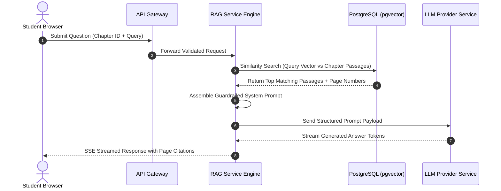

# DOCUMENT 5: AI SYSTEM DESIGN DOCUMENT

* **Document Title**: AI Subsystem & Contextual RAG Architecture — LearnPulse AI
* **Document Version**: 1.0.0-FINAL
* **Status**: Approved for AI Pipeline Implementation
* **Target Audience**: AI Engineers, Backend Engineers, Solution Architects

---

## 1. AI Subsystem Goals & Vision

The core mission of the LearnPulse AI subsystem is to provide an **intelligent, grounded digital academic tutor**.

> [!IMPORTANT]
> **The Zero-Hallucination Imperative**: The AI Tutor operates under strict context bounding. Answers are generated exclusively from document passages uploaded by course instructors. If a student query cannot be answered using the retrieved course context, the AI gracefully declines to answer, preventing hallucinated or off-syllabus responses.

---

## 2. Contextual RAG Paradigm Overview

LearnPulse AI uses **Retrieval-Augmented Generation (RAG)** to connect Large Language Models with institutional course documents.

```
[ Teacher Uploads PDF ] ---> [ Text Parsing ] ---> [ Passage Chunking ] ---> [ Generate Vector Embeddings ] ---> [ Save to pgvector ]

[ Student Query ] ---------> [ Query Vector ] ----> [ Similarity Search ] -> [ Extract Top Passages ] --------> [ Grounded Answer + Citations ]
```

---

## 3. Document Ingestion & Parsing Workflow

1. **Upload Trigger**: Instructor uploads a PDF document associated with a specific chapter.
2. **Text Extraction**: The document service parses text while tracking source page numbers.
3. **Passage Chunking**: Clean text is split into logical passages for semantic indexing.
4. **Vector Embedding**: Each passage is transformed into a high-dimensional vector using an embedding model.
5. **Database Storage**: Text passages and vectors are stored in PostgreSQL using `pgvector`.

---

## 4. Chunking Strategy

* **Strategy**: Token-aware recursive character splitting.
* **Target Passage Size**: ~500 words (~2,000 characters).
* **Passage Overlap**: 50 words (~200 characters) between consecutive passages to preserve context across boundaries.
* **Metadata Tracking**: Every passage retains references to `document_id`, `chapter_id`, and source `page_number`.

---

## 5. Embedding Strategy & Vector Storage

* **Embedding Model**: High-accuracy semantic embedding model converting passages into 1536-dimensional float arrays.
* **Vector Engine**: PostgreSQL 16 with native `pgvector` extension.
* **Indexing Mechanism**: Hierarchical Navigable Small World (HNSW) index using cosine distance operators for fast vector similarity searches.

---

## 6. Retrieval Pipeline & Cosine Similarity Search

When a student submits a question within a chapter:
1. The question string is converted into a query vector.
2. The system executes a vector similarity query in `pgvector`, filtered strictly by `chapter_id`.
3. The top matching passages meeting a minimum similarity threshold ($\ge 0.70$) are retrieved for prompt context assembly.

---

## 7. Context Assembly & Prompt Construction

The retrieved passages are formatted into a structured system prompt before being sent to the LLM.

```
+-----------------------------------------------------------------------------------+
|                            STRUCTURED RAG SYSTEM PROMPT                           |
+-----------------------------------------------------------------------------------+
| ROLE: You are the official LearnPulse AI Academic Tutor for this course.         |
|                                                                                   |
| INSTRUCTIONS:                                                                     |
| 1. Answer the student's question ONLY using the verified context passages below.  |
| 2. For every statement, include an inline citation: [Document Title, Page X].    |
| 3. If the context does not contain the answer, reply:                             |
|    "I am sorry, but this topic is not covered in your chapter study materials."  |
| 4. Do NOT use outside knowledge or answer off-topic questions.                    |
|                                                                                   |
| VERIFIED COURSE CONTEXT PASSAGES:                                                 |
| - [Doc: Operating_Systems.pdf, Page 14]: "Virtual memory decouples logical..."    |
| - [Doc: Operating_Systems.pdf, Page 15]: "Paging divides physical memory..."     |
|                                                                                   |
| STUDENT QUESTION: "Explain how virtual memory works."                            |
+-----------------------------------------------------------------------------------+
```

---

## 8. Streamed AI Response Generation & Citation Mapping

* **Streaming Mechanism**: Answers stream to the client UI in real time using Server-Sent Events (SSE) for low latency.
* **Citation Persistence**: Source passage IDs and similarity scores are saved to the `retrieved_chunks` table, creating an audit trail for every generated response.

---

## 9. End-to-End RAG Sequence Diagram



---

## 10. AI Guardrails & Prompt Injection Defense

> [!SECURITY]
> **Safety Guardrails**:
> * **Input Sanitization**: User inputs are stripped of prompt override strings (e.g., `"Ignore previous instructions"`).
> * **Context Isolation**: System prompts mandate that answers must be derived solely from retrieved passages.
> * **Audit Logging**: Flagged prompt injection attempts write security alerts to the `audit_logs` table for administrative review.

---

## 11. AI Limitations & Known Boundaries

* **Text-Only Ingestion (Phase 1)**: Ingestion extracts textual content from PDFs (embedded images/diagrams are skipped in Phase 1).
* **Course Boundary**: The AI cannot answer questions spanning non-enrolled subjects or general topics outside uploaded course documents.

---

## 12. Future AI Enhancements & Roadmap

* **Phase 2 — Multi-Format Ingestion**: Parsing mathematical formulas (LaTeX), diagrams, and video/audio lecture transcripts.
* **Phase 3 — AI-Assisted Quiz Drafting**: Automated draft question generation from uploaded PDFs for instructor review.
* **Phase 4 — Adaptive Learning Recommendations**: Suggesting specific chapter reading passages based on student quiz mistakes.
