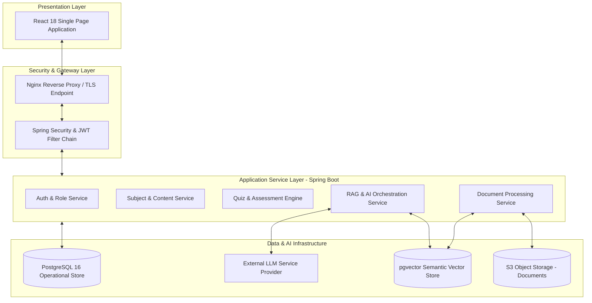
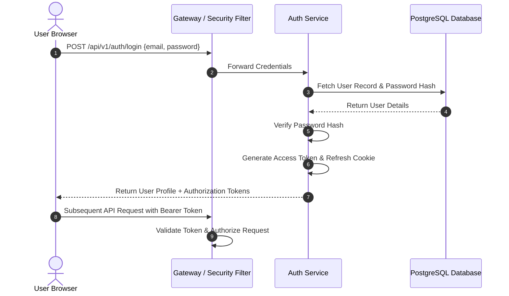
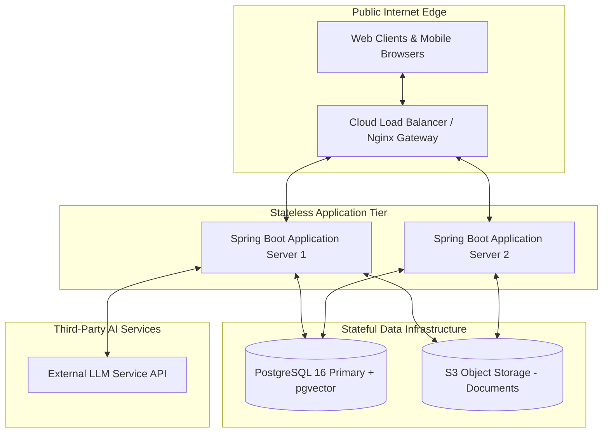
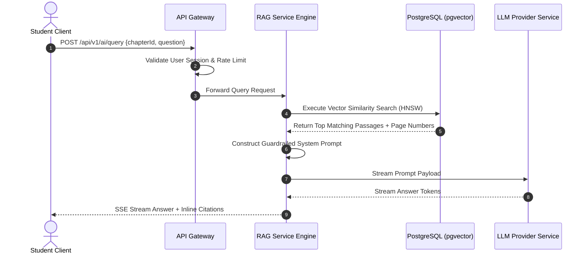
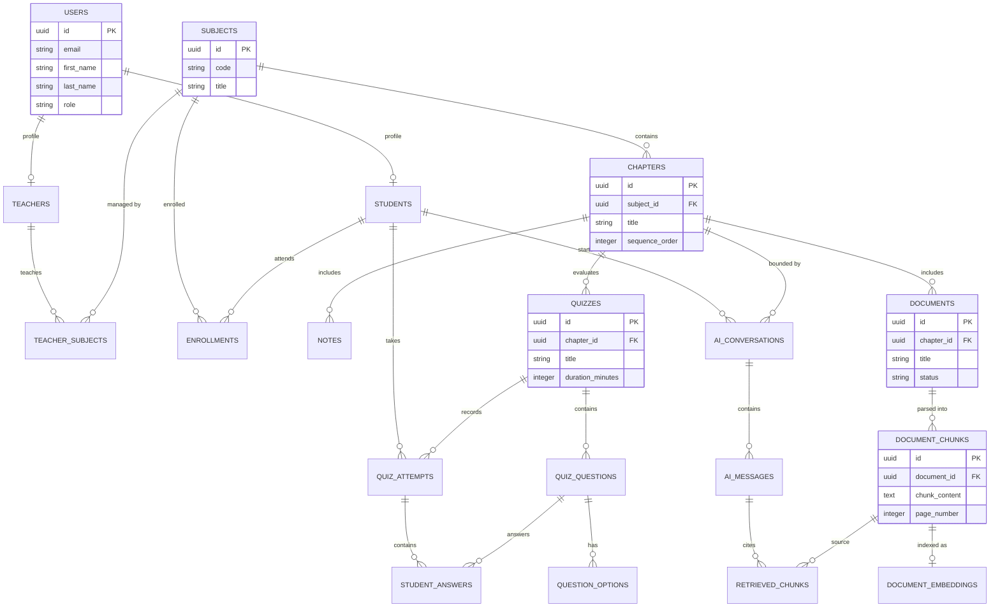
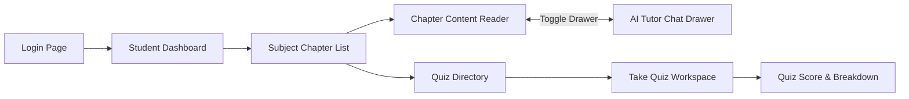
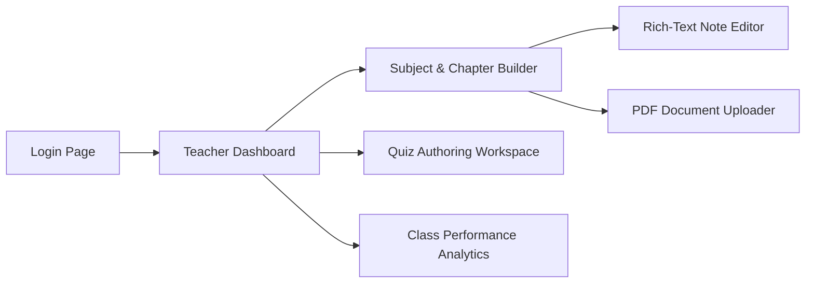
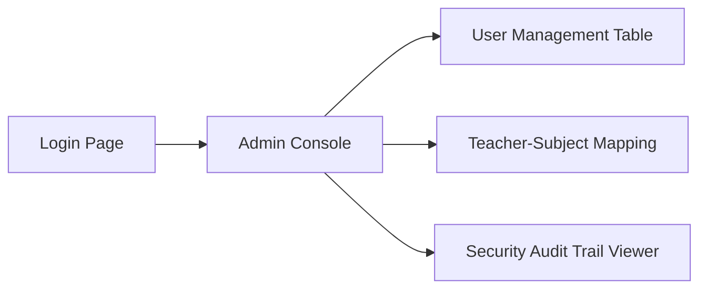
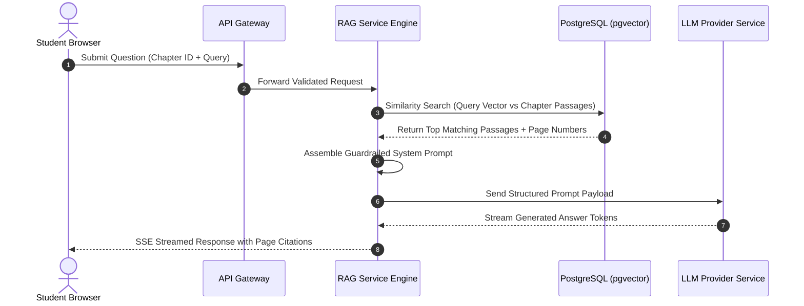

# LearnPulse AI — Enterprise AI-Powered Learning Management System
## Week 1 Engineering Design Package

---

### Document Metadata

* **Project Name**: LearnPulse AI — Enterprise AI-Powered Learning Management System with Contextual AI Tutor
* **Document Title**: Week 1 Engineering Design Package (Master Specification)
* **Document Version**: 1.0.0-FINAL
* **Release Date**: August 5, 2026
* **Prepared By**: Senior Solution Architecture, Product Management, & Technical Solution Engineering Team
* **Target Audience**: University Evaluators, Technical Mentors, Solution Architects, Client Representatives, & Engineering Leads
* **Status**: Approved for Technical Kickoff & Implementation

---

### Document Version History

| Version | Date | Author / Role | Description of Changes | Status |
| :--- | :--- | :--- | :--- | :--- |
| **0.1.0** | Aug 1, 2026 | Product Management | Initial Draft of Product Requirements (PRD) | Draft |
| **0.5.0** | Aug 3, 2026 | Solution Architecture | Initial Architecture, Database ERD & RAG Pipeline Specifications | Review |
| **1.0.0** | Aug 5, 2026 | Senior Systems Architect | Final Integration into 5-Document Master Engineering Package | Approved |

---

### Master Table of Contents

* [DOCUMENT 1: PRODUCT REQUIREMENTS DOCUMENT (PRD)](#document-1-product-requirements-document-prd)
  - [1. Executive Summary](#1-executive-summary)
  - [2. Problem Statement](#2-problem-statement)
  - [3. Project Vision](#3-project-vision)
  - [4. Objectives & Key Results (OKRs)](#4-objectives--key-results-okrs)
  - [5. Project Scope](#5-project-scope)
  - [6. Out of Scope](#6-out-of-scope)
  - [7. Functional Requirements](#7-functional-requirements)
  - [8. Non-Functional Requirements](#8-non-functional-requirements)
  - [9. User Roles & Responsibilities](#9-user-roles--responsibilities)
  - [10. User Stories & Acceptance Criteria](#10-user-stories--acceptance-criteria)
  - [11. Success Criteria & Key Performance Indicators (KPIs)](#11-success-criteria--key-performance-indicators-kpis)
  - [12. Business Value & Impact](#12-business-value--impact)
  - [13. Risk Analysis & Mitigation Matrix](#13-risk-analysis--mitigation-matrix)
  - [14. Week 1 Summary & Next Steps](#14-week-1-summary--next-steps)
* [DOCUMENT 2: HIGH LEVEL DESIGN (HLD)](#document-2-high-level-design-hld)
  - [1. System Architecture Overview](#1-system-architecture-overview)
  - [2. Core System Components](#2-core-system-components)
  - [3. Layered Architecture Deep Dive](#3-layered-architecture-deep-dive)
  - [4. Module Breakdown & Responsibilities](#4-module-breakdown--responsibilities)
  - [5. Component Interaction & Communication Protocols](#5-component-interaction--communication-protocols)
  - [6. Storage Strategy](#6-storage-strategy)
  - [7. AI Subsystem Integration Overview](#7-ai-subsystem-integration-overview)
  - [8. Authentication & Session Flow](#8-authentication--session-flow)
  - [9. Deployment Architecture & Infrastructure Topology](#9-deployment-architecture--infrastructure-topology)
  - [10. High-Level System Sequence Diagram](#10-high-level-system-sequence-diagram)
  - [11. Technology Stack Specification](#11-technology-stack-specification)
* [DOCUMENT 3: DATABASE DESIGN DOCUMENT](#document-3-database-design-document)
  - [1. Database Architecture Overview](#1-database-architecture-overview)
  - [2. Entity List & Domain Categorization](#2-entity-list--domain-categorization)
  - [3. Entity Descriptions](#3-entity-descriptions)
  - [4. Complete Entity Relationship Diagram (ERD)](#4-complete-entity-relationship-diagram-erd)
  - [5. Core Database Schema Tables](#5-core-database-schema-tables)
* [DOCUMENT 4: FRONTEND DESIGN DOCUMENT](#document-4-frontend-design-document)
  - [1. Information Architecture Strategy](#1-information-architecture-strategy)
  - [2. Page Taxonomy & Route Maps](#2-page-taxonomy--route-maps)
  - [3. Role-Based Access Control & Layout Guards](#3-role-based-access-control--layout-guards)
  - [4. User Navigation Flows](#4-user-navigation-flows)
  - [5. Dashboard Structures](#5-dashboard-structures)
  - [6. UI Module Boundaries & Component Hierarchy](#6-ui-module-boundaries--component-hierarchy)
* [DOCUMENT 5: AI SYSTEM DESIGN DOCUMENT](#document-5-ai-system-design-document)
  - [1. AI Subsystem Goals & Vision](#1-ai-subsystem-goals--vision)
  - [2. Contextual RAG Paradigm Overview](#2-contextual-rag-paradigm-overview)
  - [3. Document Ingestion & Parsing Workflow](#3-document-ingestion--parsing-workflow)
  - [4. Chunking Strategy](#4-chunking-strategy)
  - [5. Embedding Strategy & Vector Storage](#5-embedding-strategy--vector-storage)
  - [6. Retrieval Pipeline & Cosine Similarity Search](#6-retrieval-pipeline--cosine-similarity-search)
  - [7. Context Assembly & Prompt Construction](#7-context-assembly--prompt-construction)
  - [8. Streamed AI Response Generation & Citation Mapping](#8-streamed-ai-response-generation--citation-mapping)
  - [9. End-to-End RAG Sequence Diagram](#9-end-to-end-rag-sequence-diagram)
  - [10. AI Guardrails & Prompt Injection Defense](#10-ai-guardrails--prompt-injection-defense)
  - [11. AI Limitations & Known Boundaries](#11-ai-limitations--known-boundaries)
  - [12. Future AI Enhancements & Roadmap](#12-future-ai-enhancements--roadmap)

---
---

<div style="page-break-before: always;"></div>

# DOCUMENT 1: PRODUCT REQUIREMENTS DOCUMENT (PRD)

* **Document Title**: Product Requirements Document (PRD) — LearnPulse AI
* **Document Version**: 1.0.0-FINAL
* **Status**: Approved for Engineering Kickoff
* **Target Audience**: Product Managers, Academic Evaluators, Executive Stakeholders, & Engineering Leads

---

## 1. Executive Summary

**LearnPulse AI** is a next-generation, enterprise-grade Learning Management System (LMS) designed to transform traditional digital courseware into an interactive, AI-assisted learning experience. Traditional LMS platforms serve as passive content repositories, forcing students to navigate static lecture notes and PDFs without immediate academic support outside classroom hours.

LearnPulse AI solves this challenge by pairing a robust LMS (course authoring, document management, timed assessments, and progress tracking) with an embedded **Contextual AI Tutor**. Unlike generic public AI chatbots that generate unverifiable or out-of-syllabus answers, the LearnPulse AI Tutor uses **Retrieval-Augmented Generation (RAG)** to answer student questions strictly using course materials uploaded by instructors, delivering grounded answers accompanied by exact page citations.

---

## 2. Problem Statement

Modern educational institutions face three core operational and pedagogical challenges:

1. **Unverifiable Public AI Hallucinations**: Public AI chatbots answer queries using unvetted internet data. Students cannot rely on raw LLM responses for course-specific examinations or syllabus compliance.
2. **Faculty Overload & Repetitive Queries**: Instructors spend substantial hours answering routine administrative and foundational content questions already covered in lecture slides.
3. **Passive Student Engagement**: Static PDF reading yields lower comprehension and higher drop-off rates compared to active, conversational learning.

---

## 3. Project Vision

To create a secure, verifiable, and intelligent learning ecosystem where every student enjoys 24/7 access to a personalized AI Tutor strictly aligned with their course curriculum, while empowering educators with automated assessment tools and actionable learning analytics.

---

## 4. Objectives & Key Results (OKRs)

* **Objective 1: Grounded Academic AI**: Ensure $100\%$ of AI Tutor responses are derived directly from instructor-approved course documents with verifiable inline page citations.
* **Objective 2: Accelerated Assessment Execution**: Reduce teacher quiz creation and grading overhead by $70\%$ via automated grading engines and intuitive question builders.
* **Objective 3: Responsive User Experience**: Deliver sub-200ms REST API response times ($P_{95}$) and sub-1.2s Time-To-First-Token (TTFT) for AI chat streaming.
* **Objective 4: Data Security & Access Isolation**: Guarantee strict role-based data isolation so students access only enrolled course materials.

---

## 5. Project Scope

```
+-----------------------------------------------------------------------------------+
|                              LEARNPULSE AI PRODUCT SCOPE                          |
+-----------------------------------------+-----------------------------------------+
|             CORE LMS MODULES            |          CONTEXTUAL AI MODULES          |
+-----------------------------------------+-----------------------------------------+
| - Identity & Role Management            | - PDF Ingestion & Text Parsing          |
| - Subject & Chapter Syllabus Builder    | - Passage Chunking & Vector Indexing    |
| - Rich-Text Notes & PDF Distribution    | - Course-Bounded RAG Q&A Engine         |
| - Timed Quiz Builder & Auto-Grading     | - Inline Page & Passage Citations       |
| - Student Progress & Class Analytics    | - Prompt Injection Guardrails           |
+-----------------------------------------+-----------------------------------------+
```

---

## 6. Out of Scope

* **Native Mobile Binaries**: Phase 1 delivers a fully responsive Web SPA (iOS/Android native apps deferred to Phase 2).
* **Live Video Streaming**: Real-time video hosting is out of scope; instructors may embed external meeting links (e.g., Zoom/Google Meet).
* **Subjective Long-Essay AI Grading**: Phase 1 supports Multiple Choice (MCQ) and True/False assessments; subjective long-form AI grading is scheduled for Phase 2.

---

## 7. Functional Requirements

### 7.1 Authentication & Role Management
* **FR-AUTH-01**: Secure user authentication via email credentials and password validation.
* **FR-AUTH-02**: Stateless session authorization supporting Student, Teacher, and Administrator roles.
* **FR-AUTH-03**: Secure password recovery via time-bound recovery tokens.

### 7.2 Student Learning Workspace
* **FR-STU-01**: Browse enrolled subjects, sequential chapters, rich-text lecture notes, and attached PDF slides.
* **FR-STU-02**: Launch interactive AI Tutor sessions scoped to a specific subject, chapter, or document.
* **FR-STU-03**: Attempt timed chapter quizzes with automated submission timers and instant score breakdowns.
* **FR-STU-04**: Track personal progress metrics (reading completion rates, quiz grades, AI study queries).

### 7.3 Teacher Workspace
* **FR-TCH-01**: Create and manage assigned subjects, chapters, notes, and document attachments.
* **FR-TCH-02**: Upload PDF study files, automatically triggering background text parsing and semantic indexing.
* **FR-TCH-03**: Author chapter quizzes with configurable question pools, time limits, and passing thresholds.
* **FR-TCH-04**: View aggregate class analytics, student grade distributions, and high-frequency student AI queries.

### 7.4 Administrator Workspace
* **FR-ADM-01**: Provision user accounts, edit profiles, toggle account active states, and assign user roles.
* **FR-ADM-02**: Allocate faculty members to specific academic subjects.
* **FR-ADM-03**: Inspect system health metrics, storage utilization, vector search latency, and audit logs.

---

## 8. Non-Functional Requirements

| Requirement Category | Metric / SLA | Justification |
| :--- | :--- | :--- |
| **API Latency** | $< 200\text{ ms}$ ($P_{95}$) | Ensures smooth dashboard navigation and UI responsiveness |
| **Vector Search Latency**| $< 50\text{ ms}$ | Maintains fast document passage retrieval in `pgvector` |
| **AI Stream Latency** | $< 1.2\text{ s}$ TTFT | Provides immediate feedback when streaming AI answers |
| **System Availability**| $99.9\%$ Uptime | High availability for student exam windows |
| **Data Integrity** | $100\%$ ACID Compliance | Prevents corrupted quiz attempts or orphan vector embeddings |
| **Security Standard** | TLS 1.3 & Role Isolation | Protects student records and institutional intellectual property |

---

## 9. User Roles & Responsibilities

```
                                +---------------------------+
                                |    LEARNPULSE AI ROLES    |
                                +---------------------------+
                                              |
       +--------------------------------------+--------------------------------------+
       |                                      |                                      |
       v                                      v                                      v
  [ STUDENT ]                            [ TEACHER ]                          [ ADMINISTRATOR ]
  - Reads Course Content                 - Structures Chapters                - User Account Provisioning
  - Queries AI Tutor                     - Uploads PDFs & Notes               - Faculty-Subject Allocation
  - Takes Timed Quizzes                  - Authors Assessments                - System Audit Monitoring
  - Monitors Progress                    - Analyzes Class Trends              - Resource Governance
```

---

## 10. User Stories & Acceptance Criteria

### User Story 1: Student Contextual Q&A
* **As a** Student enrolled in a course,
* **I want to** ask the AI Tutor questions about a specific chapter's reading materials,
* **So that** I can clarify difficult concepts late at night with exact citations.
* **Acceptance Criteria**:
  * Given a student is viewing Chapter 3, when they submit a question in the AI panel, the response must return within 2 seconds.
  * The response must cite the source document name and page number.
  * If the question falls outside the uploaded chapter materials, the AI must state that the topic is not covered in the provided materials.

### User Story 2: Teacher PDF Upload & Ingestion
* **As a** Course Instructor,
* **I want to** upload lecture PDF slides to a chapter,
* **So that** the system automatically indexes the content for AI study assistance.
* **Acceptance Criteria**:
  * Uploading a valid PDF ($<50\text{MB}$) displays a "Processing" status badge.
  * Text extraction and semantic vector creation execute asynchronously in the background.
  * Once processed, the document status updates to "Ready," enabling student AI queries against it.

### User Story 3: Student Timed Quiz Attempt
* **As a** Student,
* **I want to** attempt a timed chapter quiz,
* **So that** I can test my understanding before final exams.
* **Acceptance Criteria**:
  * Clicking "Start Quiz" initializes a countdown timer based on the quiz's duration limit.
  * If the timer reaches 0:00, the system automatically submits open answers.
  * Upon submission, the student immediately views their final grade percentage and correct option explanations.

---

## 11. Success Criteria & Key Performance Indicators (KPIs)

1. **AI Citation Precision**: $> 98\%$ of AI-generated statements correctly map to retrieved document passages.
2. **User Engagement**: Average student study time increases by $\ge 40\%$ compared to static PDF reading.
3. **Assessment Efficiency**: $100\%$ of Multiple Choice quizzes are auto-graded instantly upon submission.
4. **Platform Stability**: Zero unexpected database downtimes during peak exam submission windows.

---

## 12. Business Value & Impact

* **For Educational Institutions**: Modernizes digital infrastructure, increases student retention, and provides scalable academic support without increasing teaching staff headcount.
* **For Faculty**: Eliminates manual grading of standard quizzes and reduces repetitive administrative inquiries.
* **For Students**: Delivers personalized, 24/7 academic tutoring grounded in verified course materials.

---

## 13. Risk Analysis & Mitigation Matrix

| Identified Risk | Severity | Likelihood | Risk Mitigation Strategy |
| :--- | :---: | :---: | :--- |
| **AI Prompt Injection Attacks** | High | Medium | Sanitize user prompts; enforce strict system prompt guardrails overriding off-topic requests. |
| **Vector Search Latency Spikes**| Medium | Low | Scope similarity searches by `chapter_id`; optimize HNSW vector indexes in `pgvector`. |
| **Large File Upload Failures** | Medium | Medium | Validate file MIME types; enforce 50MB file size limits; process ingestion asynchronously. |
| **Unauthorized Document Sharing**| High | Low | Store files privately in cloud storage; issue temporary access links valid for 15 minutes. |

---

## 14. Week 1 Summary & Next Steps

This Product Requirements Document completes the functional and strategic baseline for **LearnPulse AI**.

#### Engineering Kickoff Next Steps:
1. Review High-Level Architecture (Document 2) and Database Schemas (Document 3).
2. Establish API contract specifications for frontend and backend integration.
3. Prepare staging environment infrastructure for database and cloud storage initialization.

---
---

<div style="page-break-before: always;"></div>

# DOCUMENT 2: HIGH LEVEL DESIGN (HLD)

* **Document Title**: High Level Design (HLD) Specification — LearnPulse AI
* **Document Version**: 1.0.0-FINAL
* **Status**: Approved for Technical Implementation
* **Target Audience**: Solution Architects, Backend/Frontend Engineers, Systems Administrators

---

## 1. System Architecture Overview

LearnPulse AI adopts a **clean, layered architecture** separating presentation, API security, application services, and stateful storage tiers.



---

## 2. Core System Components

1. **React SPA Client**: Delivers an interactive user workspace for students, teachers, and administrators. Communicates via REST APIs and Server-Sent Events (SSE).
2. **Security Gateway**: Nginx terminates TLS connections, routes API traffic, and enforces gateway rate limits. Spring Security validates access tokens and role privileges.
3. **Spring Boot Core Services**:
   * *Auth Service*: Manages user credentials, token issuance, and password security.
   * *Content Service*: Manages subjects, chapters, notes, and file metadata.
   * *Document Ingestion Service*: Parses uploaded PDFs, extracts text passages, and generates semantic vectors.
   * *Quiz Engine*: Controls assessment creation, timers, submission grading, and score persistence.
   * *RAG Engine*: Manages vector similarity searches, prompt construction, safety guardrails, and streaming AI responses.
4. **Data Infrastructure**:
   * *PostgreSQL 16*: Manages relational data (users, courses, quizzes, attempts).
   * *`pgvector` Extension*: Stores semantic passage vectors natively within PostgreSQL, enabling fast vector searches alongside relational data.
   * *S3 Object Storage*: Cloud storage for uploaded PDF study materials.
   * *LLM Provider Gateway*: Interface for vector embedding generation and streaming text completion.

---

## 3. Layered Architecture Deep Dive

```
+-----------------------------------------------------------------------------------+
|                           LEARNPULSE AI LAYER RESPONSIBILITIES                    |
+-----------------------------------------------------------------------------------+
| 1. PRESENTATION LAYER     | React 18 SPA, UI Components, SSE Streaming Client     |
| 2. SECURITY GATEWAY LAYER | TLS 1.3, Nginx Reverse Proxy, Spring Security Filter |
| 3. SERVICE APPLICATION    | Spring Boot Services, Ingestion Engine, Quiz Engine   |
| 4. DATA STORAGE LAYER     | PostgreSQL 16, pgvector Store, S3 Cloud Storage       |
| 5. AI INTEGRATION LAYER   | Semantic Embedding Model, Large Language Model        |
+-----------------------------------------------------------------------------------+
```

---

## 4. Module Breakdown & Responsibilities

| Module | Responsibilities | Dependencies | Data Managed |
| :--- | :--- | :--- | :--- |
| **Authentication** | User login, token issuance, session checks | User Service | `users`, `refresh_tokens` |
| **Student Portal** | Course reading, study tools, progress tracking | Content, Quiz, AI Tutor | `student_progress` |
| **Teacher Portal** | Course creation, PDF uploads, quiz authoring | Content, Ingestion, Analytics| `subjects`, `chapters`, `notes` |
| **Admin Portal** | Account provisioning, subject allocations | User Service, Audit Service | `users`, `audit_logs` |
| **Content Management**| Structuring subjects, chapters, notes, and files | S3 Storage, Ingestion Svc | `notes`, `documents` |
| **Document Ingestion**| PDF text extraction, passage chunking, vectors | Content, `pgvector` | `document_chunks`, `embeddings`|
| **Quiz Engine** | Timed assessments, answer evaluation, scoring | Student, Teacher | `quizzes`, `quiz_attempts` |
| **AI Tutor (RAG)** | Passage retrieval, prompt assembly, streaming Q&A | `pgvector`, LLM Gateway | `ai_conversations`, `messages` |

---

## 5. Component Interaction & Communication Protocols

* **Client $\leftrightarrow$ Gateway**: Secure HTTPS REST endpoints for standard data operations; Server-Sent Events (SSE) for low-latency streaming AI chat completions.
* **Backend Services $\leftrightarrow$ Database**: PostgreSQL connection pool (HikariCP) handling transactional queries and vector similarity searches.
* **Backend Services $\leftrightarrow$ Object Storage**: S3 API protocol for secure file uploads and presigned link generation.
* **Backend Services $\leftrightarrow$ LLM Provider**: Secure HTTPS API requests for embedding generation and completions.

---

## 6. Storage Strategy

> [!TIP]
> **Unified Database Strategy**: Using PostgreSQL with `pgvector` allows operational data (users, courses, quizzes) and vector embeddings to reside within the same database engine. This eliminates the need to synchronize separate relational and vector databases.

```
       +---------------------------------------------------------------------+
       |                       STORAGE ARCHITECTURE                          |
       +---------------------------------------------------------------------+
                                          |
             +----------------------------+----------------------------+
             |                                                         |
             v                                                         v
  [ PostgreSQL 16 Database ]                                [ Cloud Object Storage ]
  - Relational Tables (Users, Courses, Quizzes)             - Uploaded PDF Study Files
  - Native pgvector Store (Passage Embeddings)             - Temporary 15-Min Access Links
  - Transactional ACID Operations                           - Durable Blob Storage
```

---

## 7. AI Subsystem Integration Overview

The AI integration follows a **Retrieval-Augmented Generation (RAG)** workflow:
1. **Passage Retrieval**: When a student asks a question, the backend queries `pgvector` for the top matching document passages from that chapter.
2. **Context Injection**: Retrieved passages are combined with safety guardrails into a structured system prompt.
3. **Grounded Completion**: The prompt is sent to the LLM, which streams back a response containing explicit page citations.

---

## 8. Authentication & Session Flow



---

## 9. Deployment Architecture & Infrastructure Topology



---

## 10. High-Level System Sequence Diagram



---

## 11. Technology Stack Specification

| Component | Selected Technology | Role & Justification |
| :--- | :--- | :--- |
| **Frontend SPA** | React 18 & TypeScript | Component-based UI with compile-time type safety |
| **Backend Framework**| Spring Boot 3.x (Java 21)| Enterprise service execution and REST API management |
| **Database Engine** | PostgreSQL 16 | Relational operational data storage with ACID guarantees |
| **Vector Search** | `pgvector` Extension | Native vector search integrated inside PostgreSQL |
| **Object Storage** | AWS S3 / MinIO | Scalable, durable storage for uploaded PDF study materials |
| **AI / RAG Pipeline**| Large Language Model | Passage embedding and grounded answer generation |

---
---

<div style="page-break-before: always;"></div>

# DOCUMENT 3: DATABASE DESIGN DOCUMENT

* **Document Title**: Relational & Vector Database Design Document — LearnPulse AI
* **Document Version**: 1.0.0-FINAL
* **Status**: Approved for Database Migration Scripting
* **Target Audience**: Database Administrators, Backend Engineers, Data Engineers

---

## 1. Database Architecture Overview

The LearnPulse AI database is built on **PostgreSQL 16**, augmented by the native **`pgvector`** extension. This single-database architecture manages structured operational data (users, courses, quizzes) alongside high-dimensional vector embeddings within a unified, transactional storage engine.

---

## 2. Entity List & Domain Categorization

```
+-----------------------------------------------------------------------------------+
|                        LEARNPULSE AI DATABASE ENTITIES                            |
+-------------------+-------------------+-------------------+-----------------------+
|  AUTHENTICATION   |     LEARNING      |      CONTENT      |      ASSESSMENT       |
|  - users          |  - students       |  - notes          |  - quizzes            |
|  - refresh_tokens |  - teachers       |  - documents      |  - quiz_questions     |
|  - audit_logs     |  - subjects       |  - doc_chunks     |  - question_options   |
|                   |  - chapters       |  - embeddings     |  - quiz_attempts      |
|                   |  - enrollments    |                   |  - student_answers    |
+-------------------+-------------------+-------------------+-----------------------+
|        AI & CONTEXTUAL RAG            |             ADMINISTRATION                |
|  - ai_conversations                   |  - teacher_subjects                       |
|  - ai_messages                        |  - system_settings                        |
|  - retrieved_chunks                   |  - student_progress                       |
+---------------------------------------+-------------------------------------------+
```

---

## 3. Entity Descriptions

* **`users`**: Central account identity store for all platform users.
* **`students`**: Academic profile extensions for student users.
* **`teachers`**: Faculty profile extensions for instructors.
* **`subjects`**: Master record of academic courses.
* **`chapters`**: Sequential modules constituting a subject's syllabus.
* **`notes`**: Rich-text lecture notes published by instructors.
* **`documents`**: Metadata for uploaded PDF study files.
* **`document_chunks`**: Segmented text passages extracted from PDFs for semantic retrieval.
* **`document_embeddings`**: High-dimensional vector store enabled by `pgvector`.
* **`quizzes`**: Assessment configurations associated with course chapters.
* **`quiz_questions`**: Questions defining an assessment.
* **`question_options`**: Multiple-choice options for assessment questions.
* **`quiz_attempts`**: Records of student assessment executions and final grades.
* **`student_answers`**: Audit record of individual answers submitted during an attempt.
* **`student_progress`**: Reading and completion tracking per student per chapter.
* **`ai_conversations`**: Context-bounded AI chat sessions.
* **`ai_messages`**: Individual messages within an AI conversation.
* **`retrieved_chunks`**: Audit table mapping AI messages to exact document citations.

---

## 4. Complete Entity Relationship Diagram (ERD)



---

## 5. Core Database Schema Tables

### 5.1 Identity & User Domain Tables

#### Table: `users`
* **Purpose**: Primary identity record for all platform users.

| Column | Data Type | Key / Constraints | Description |
| :--- | :--- | :--- | :--- |
| `id` | `UUID` | `PRIMARY KEY` | Unique user identifier |
| `email` | `VARCHAR(255)` | `NOT NULL, UNIQUE` | User email address (login identifier) |
| `password_hash` | `VARCHAR(255)` | `NOT NULL` | Encrypted password hash |
| `first_name` | `VARCHAR(100)` | `NOT NULL` | Given name |
| `last_name` | `VARCHAR(100)` | `NOT NULL` | Surname |
| `role` | `VARCHAR(20)` | `NOT NULL` | Role: `'STUDENT'`, `'TEACHER'`, `'ADMIN'` |
| `is_active` | `BOOLEAN` | `NOT NULL` | Account active toggle |

#### Table: `students`
* **Purpose**: Extended academic profile for student users.

| Column | Data Type | Key / Constraints | Description |
| :--- | :--- | :--- | :--- |
| `id` | `UUID` | `PRIMARY KEY` | Profile ID |
| `user_id` | `UUID` | `FOREIGN KEY -> users(id)` | Linked user account |
| `enrollment_number`| `VARCHAR(50)` | `NOT NULL, UNIQUE` | Institutional student ID |
| `academic_year` | `VARCHAR(20)` | `NOT NULL` | Current academic year |

#### Table: `teachers`
* **Purpose**: Extended profile for faculty members.

| Column | Data Type | Key / Constraints | Description |
| :--- | :--- | :--- | :--- |
| `id` | `UUID` | `PRIMARY KEY` | Profile ID |
| `user_id` | `UUID` | `FOREIGN KEY -> users(id)` | Linked user account |
| `department` | `VARCHAR(100)` | `NOT NULL` | Academic department |
| `qualification` | `VARCHAR(100)` | `NULL` | Faculty qualification |

---

### 5.2 Course Content Domain Tables

#### Table: `subjects`
* **Purpose**: Master record of academic courses.

| Column | Data Type | Key / Constraints | Description |
| :--- | :--- | :--- | :--- |
| `id` | `UUID` | `PRIMARY KEY` | Subject ID |
| `code` | `VARCHAR(20)` | `NOT NULL, UNIQUE` | Course code (e.g. "CS-401") |
| `title` | `VARCHAR(200)` | `NOT NULL` | Course title |
| `description` | `TEXT` | `NULL` | Detailed course overview |
| `is_active` | `BOOLEAN` | `NOT NULL` | Subject availability toggle |

#### Table: `chapters`
* **Purpose**: Sequential modules constituting a subject syllabus.

| Column | Data Type | Key / Constraints | Description |
| :--- | :--- | :--- | :--- |
| `id` | `UUID` | `PRIMARY KEY` | Chapter ID |
| `subject_id` | `UUID` | `FOREIGN KEY -> subjects(id)` | Parent subject |
| `title` | `VARCHAR(200)` | `NOT NULL` | Chapter header |
| `sequence_order` | `INTEGER` | `NOT NULL` | Position in syllabus |

#### Table: `notes`
* **Purpose**: Rich-text lecture notes published by instructors.

| Column | Data Type | Key / Constraints | Description |
| :--- | :--- | :--- | :--- |
| `id` | `UUID` | `PRIMARY KEY` | Note ID |
| `chapter_id` | `UUID` | `FOREIGN KEY -> chapters(id)` | Parent chapter |
| `title` | `VARCHAR(200)` | `NOT NULL` | Note title |
| `content_html` | `TEXT` | `NOT NULL` | Formatted note content |

#### Table: `documents`
* **Purpose**: Metadata for uploaded PDF study files.

| Column | Data Type | Key / Constraints | Description |
| :--- | :--- | :--- | :--- |
| `id` | `UUID` | `PRIMARY KEY` | Document ID |
| `chapter_id` | `UUID` | `FOREIGN KEY -> chapters(id)` | Parent chapter |
| `title` | `VARCHAR(255)` | `NOT NULL` | Original filename |
| `file_key` | `VARCHAR(500)` | `NOT NULL` | Object storage key |
| `status` | `VARCHAR(20)` | `NOT NULL` | Status: `'PENDING'`, `'READY'`, `'FAILED'` |

#### Table: `document_chunks`
* **Purpose**: Segmented passages extracted from PDFs for semantic retrieval.

| Column | Data Type | Key / Constraints | Description |
| :--- | :--- | :--- | :--- |
| `id` | `UUID` | `PRIMARY KEY` | Chunk ID |
| `document_id` | `UUID` | `FOREIGN KEY -> documents(id)`| Parent document |
| `chunk_index` | `INTEGER` | `NOT NULL` | Passage index |
| `chunk_content` | `TEXT` | `NOT NULL` | Extracted passage text |
| `page_number` | `INTEGER` | `NULL` | Source page number |

#### Table: `document_embeddings`
* **Purpose**: High-dimensional vector store enabled by `pgvector`.

| Column | Data Type | Key / Constraints | Description |
| :--- | :--- | :--- | :--- |
| `id` | `UUID` | `PRIMARY KEY` | Embedding ID |
| `chunk_id` | `UUID` | `FOREIGN KEY -> document_chunks(id)`| Parent passage chunk |
| `embedding` | `vector(1536)` | `NOT NULL` | Semantic vector array |

---

### 5.3 Assessment Domain Tables

#### Table: `quizzes`
* **Purpose**: Chapter assessment configurations.

| Column | Data Type | Key / Constraints | Description |
| :--- | :--- | :--- | :--- |
| `id` | `UUID` | `PRIMARY KEY` | Quiz ID |
| `chapter_id` | `UUID` | `FOREIGN KEY -> chapters(id)` | Parent chapter |
| `title` | `VARCHAR(200)` | `NOT NULL` | Quiz title |
| `duration_minutes`| `INTEGER` | `NOT NULL` | Allowed time limit |
| `passing_score` | `INTEGER` | `NOT NULL` | Pass threshold percentage |

#### Table: `quiz_questions`
* **Purpose**: Individual questions defining an assessment.

| Column | Data Type | Key / Constraints | Description |
| :--- | :--- | :--- | :--- |
| `id` | `UUID` | `PRIMARY KEY` | Question ID |
| `quiz_id` | `UUID` | `FOREIGN KEY -> quizzes(id)` | Parent quiz |
| `question_text` | `TEXT` | `NOT NULL` | Question statement |
| `question_type` | `VARCHAR(20)` | `NOT NULL` | Type: `'MCQ'`, `'TRUE_FALSE'` |
| `points` | `INTEGER` | `NOT NULL` | Score value |

#### Table: `question_options`
* **Purpose**: Multiple-choice options for assessment questions.

| Column | Data Type | Key / Constraints | Description |
| :--- | :--- | :--- | :--- |
| `id` | `UUID` | `PRIMARY KEY` | Option ID |
| `question_id` | `UUID` | `FOREIGN KEY -> quiz_questions(id)`| Parent question |
| `option_text` | `TEXT` | `NOT NULL` | Display option text |
| `is_correct` | `BOOLEAN` | `NOT NULL` | Correct answer flag |

#### Table: `quiz_attempts`
* **Purpose**: Student assessment executions and final grades.

| Column | Data Type | Key / Constraints | Description |
| :--- | :--- | :--- | :--- |
| `id` | `UUID` | `PRIMARY KEY` | Attempt ID |
| `quiz_id` | `UUID` | `FOREIGN KEY -> quizzes(id)` | Parent quiz |
| `student_id` | `UUID` | `FOREIGN KEY -> students(id)` | Student taking attempt |
| `score_percentage`| `NUMERIC(5,2)` | `NULL` | Final calculated score |
| `status` | `VARCHAR(20)` | `NOT NULL` | Status: `'IN_PROGRESS'`, `'SUBMITTED'` |

---

### 5.4 AI & Context Domain Tables

#### Table: `ai_conversations`
* **Purpose**: Context-bounded AI study chat sessions.

| Column | Data Type | Key / Constraints | Description |
| :--- | :--- | :--- | :--- |
| `id` | `UUID` | `PRIMARY KEY` | Conversation ID |
| `student_id` | `UUID` | `FOREIGN KEY -> students(id)` | Owning student |
| `chapter_id` | `UUID` | `FOREIGN KEY -> chapters(id)` | Bounding course chapter |
| `title` | `VARCHAR(200)` | `NOT NULL` | Session title |

#### Table: `ai_messages`
* **Purpose**: Individual messages within an AI conversation.

| Column | Data Type | Key / Constraints | Description |
| :--- | :--- | :--- | :--- |
| `id` | `UUID` | `PRIMARY KEY` | Message ID |
| `conversation_id`| `UUID` | `FOREIGN KEY -> ai_conversations(id)`| Parent session |
| `sender_type` | `VARCHAR(10)` | `NOT NULL` | Sender: `'USER'`, `'ASSISTANT'` |
| `message_text` | `TEXT` | `NOT NULL` | Message body |

#### Table: `retrieved_chunks`
* **Purpose**: Citation map linking AI answers to retrieved source passages.

| Column | Data Type | Key / Constraints | Description |
| :--- | :--- | :--- | :--- |
| `id` | `UUID` | `PRIMARY KEY` | Map ID |
| `message_id` | `UUID` | `FOREIGN KEY -> ai_messages(id)` | AI assistant message |
| `chunk_id` | `UUID` | `FOREIGN KEY -> document_chunks(id)`| Retrieved source passage |
| `similarity_score`| `NUMERIC(5,4)` | `NOT NULL` | Vector similarity score |

---
---

<div style="page-break-before: always;"></div>

# DOCUMENT 4: FRONTEND DESIGN DOCUMENT

* **Document Title**: Frontend Information Architecture & Navigation Design — LearnPulse AI
* **Document Version**: 1.0.0-FINAL
* **Status**: Approved for UI/UX Development
* **Target Audience**: Frontend Engineers, UI/UX Designers, Product Managers

---

## 1. Information Architecture Strategy

The LearnPulse AI frontend is structured as a responsive **React 18 Single Page Application (SPA)**. It enforces a strict role-based layout taxonomy, providing tailored workspace layouts for Students, Teachers, and Administrators.

```
                                  +-----------------------+
                                  |   FRONTEND TAXONOMY   |
                                  +-----------------------+
                                              |
       +-------------------+------------------+------------------+
       |                   |                  |                  |
       v                   v                  v                  v
  [ PUBLIC ]          [ STUDENT ]        [ TEACHER ]          [ ADMIN ]
  - Authentication    - Course Reader    - Course Authoring   - User Accounts
  - Recovery Portal   - AI Tutor Panel   - Quiz Builder       - Faculty Allocation
  - Error Pages       - Timed Quizzes    - Class Analytics    - Audit Inspector
```

---

## 2. Page Taxonomy & Route Maps

### 2.1 Public Unauthenticated Routes
* `/login`: Primary user authentication portal.
* `/forgot-password`: Password recovery request page.
* `/404`: Page not found boundary.

### 2.2 Student Workspace Routes (Wrapped in `StudentLayout`)
* `/student/dashboard`: Enrolled subjects overview, upcoming quizzes, study activity.
* `/student/subjects`: Directory of active enrolled courses.
* `/student/subjects/:subjectId/chapters/:chapterId`: Main chapter learning reader featuring split-screen Notes, PDF Viewer, and expandable AI Tutor drawer.
* `/student/quizzes/:quizId/take`: Interactive quiz attempt workspace with countdown timer.
* `/student/quizzes/:quizId/results/:attemptId`: Quiz results breakdown and answer explanations.

### 2.3 Teacher Workspace Routes (Wrapped in `TeacherLayout`)
* `/teacher/dashboard`: Overview of assigned subjects, document ingestion statuses, class alerts.
* `/teacher/subjects/:subjectId/chapters`: Chapter module reordering and syllabus builder.
* `/teacher/subjects/:subjectId/chapters/:chapterId/edit`: Rich-text note editor and PDF upload interface.
* `/teacher/quizzes/create`: Quiz authoring tool and question builder.
* `/teacher/analytics`: Class performance distribution, topic difficulty metrics, and top AI query trends.

### 2.4 Administration Workspace Routes (Wrapped in `AdminLayout`)
* `/admin/dashboard`: System health overview, database storage metrics, vector search latencies.
* `/admin/users`: User account management directory (create, status toggle, role edit).
* `/admin/subject-assignments`: Interface for allocating faculty to academic subjects.
* `/admin/audit-logs`: System audit trail inspector.

---

## 3. Role-Based Access Control & Layout Guards

```
[ Incoming URL Request ]
           |
           v
  < Session Active? >  --- No ---> Redirect to /login
           |
          Yes
           v
  < Role Authorized? > --- No ---> Redirect to /403 Forbidden
           |
          Yes
           v
  [ Render Role Layout Component ]
```

---

## 4. User Navigation Flows

### 4.1 Student Navigation Flow



### 4.2 Teacher Navigation Flow



### 4.3 Administrator Navigation Flow



---

## 5. Dashboard Structures

### Student Dashboard
* **Header**: Welcome message, academic year, personal progress summary.
* **Main Area**: Enrolled course cards showing chapter completion progress bars.
* **Sidebar**: Pending quizzes, recent AI Q&A sessions, quick-start study buttons.

### Teacher Dashboard
* **Header**: Assigned subjects overview, total student count.
* **Main Area**: Course management cards, recent PDF processing statuses ("Ready" / "Processing").
* **Sidebar**: Quiz submission activity, class grade averages, AI query topic trends.

---

## 6. UI Module Boundaries & Component Hierarchy

```
[ Application Root ]
  ├── [ AuthProvider ] (Manages JWT & User Session)
  ├── [ Router ]
  │     ├── [ PublicLayout ]
  │     │     └── LoginView / ForgotPasswordView
  │     ├── [ StudentLayout ]
  │     │     ├── NavigationSidebar
  │     │     ├── ChapterReaderView
  │     │     │     ├── RichTextNoteViewer
  │     │     │     ├── PDFDocumentViewer
  │     │     │     └── AITutorDrawer (SSE Client + Citation Links)
  │     │     └── QuizExecutionView (Timer + Question Panel)
  │     ├── [ TeacherLayout ]
  │     │     ├── CourseManagementView
  │     │     ├── PDFUploadModal (Progress + Status Badge)
  │     │     └── QuizAuthoringView
  │     └── [ AdminLayout ]
  │           └── UserManagementTable / AuditLogViewer
```

---
---

<div style="page-break-before: always;"></div>

# DOCUMENT 5: AI SYSTEM DESIGN DOCUMENT

* **Document Title**: AI Subsystem & Contextual RAG Architecture — LearnPulse AI
* **Document Version**: 1.0.0-FINAL
* **Status**: Approved for AI Pipeline Implementation
* **Target Audience**: AI Engineers, Backend Engineers, Solution Architects

---

## 1. AI Subsystem Goals & Vision

The core mission of the LearnPulse AI subsystem is to provide an **intelligent, grounded digital academic tutor**.

> [!IMPORTANT]
> **The Zero-Hallucination Imperative**: The AI Tutor operates under strict context bounding. Answers are generated exclusively from document passages uploaded by course instructors. If a student query cannot be answered using the retrieved course context, the AI gracefully declines to answer, preventing hallucinated or off-syllabus responses.

---

## 2. Contextual RAG Paradigm Overview

LearnPulse AI uses **Retrieval-Augmented Generation (RAG)** to connect Large Language Models with institutional course documents.

```
[ Teacher Uploads PDF ] ---> [ Text Parsing ] ---> [ Passage Chunking ] ---> [ Generate Vector Embeddings ] ---> [ Save to pgvector ]

[ Student Query ] ---------> [ Query Vector ] ----> [ Similarity Search ] -> [ Extract Top Passages ] --------> [ Grounded Answer + Citations ]
```

---

## 3. Document Ingestion & Parsing Workflow

1. **Upload Trigger**: Instructor uploads a PDF document associated with a specific chapter.
2. **Text Extraction**: The document service parses text while tracking source page numbers.
3. **Passage Chunking**: Clean text is split into logical passages for semantic indexing.
4. **Vector Embedding**: Each passage is transformed into a high-dimensional vector using an embedding model.
5. **Database Storage**: Text passages and vectors are stored in PostgreSQL using `pgvector`.

---

## 4. Chunking Strategy

* **Strategy**: Token-aware recursive character splitting.
* **Target Passage Size**: ~500 words (~2,000 characters).
* **Passage Overlap**: 50 words (~200 characters) between consecutive passages to preserve context across boundaries.
* **Metadata Tracking**: Every passage retains references to `document_id`, `chapter_id`, and source `page_number`.

---

## 5. Embedding Strategy & Vector Storage

* **Embedding Model**: High-accuracy semantic embedding model converting passages into 1536-dimensional float arrays.
* **Vector Engine**: PostgreSQL 16 with native `pgvector` extension.
* **Indexing Mechanism**: Hierarchical Navigable Small World (HNSW) index using cosine distance operators for fast vector similarity searches.

---

## 6. Retrieval Pipeline & Cosine Similarity Search

When a student submits a question within a chapter:
1. The question string is converted into a query vector.
2. The system executes a vector similarity query in `pgvector`, filtered strictly by `chapter_id`.
3. The top matching passages meeting a minimum similarity threshold ($\ge 0.70$) are retrieved for prompt context assembly.

---

## 7. Context Assembly & Prompt Construction

The retrieved passages are formatted into a structured system prompt before being sent to the LLM.

```
+-----------------------------------------------------------------------------------+
|                            STRUCTURED RAG SYSTEM PROMPT                           |
+-----------------------------------------------------------------------------------+
| ROLE: You are the official LearnPulse AI Academic Tutor for this course.         |
|                                                                                   |
| INSTRUCTIONS:                                                                     |
| 1. Answer the student's question ONLY using the verified context passages below.  |
| 2. For every statement, include an inline citation: [Document Title, Page X].    |
| 3. If the context does not contain the answer, reply:                             |
|    "I am sorry, but this topic is not covered in your chapter study materials."  |
| 4. Do NOT use outside knowledge or answer off-topic questions.                    |
|                                                                                   |
| VERIFIED COURSE CONTEXT PASSAGES:                                                 |
| - [Doc: Operating_Systems.pdf, Page 14]: "Virtual memory decouples logical..."    |
| - [Doc: Operating_Systems.pdf, Page 15]: "Paging divides physical memory..."     |
|                                                                                   |
| STUDENT QUESTION: "Explain how virtual memory works."                            |
+-----------------------------------------------------------------------------------+
```

---

## 8. Streamed AI Response Generation & Citation Mapping

* **Streaming Mechanism**: Answers stream to the client UI in real time using Server-Sent Events (SSE) for low latency.
* **Citation Persistence**: Source passage IDs and similarity scores are saved to the `retrieved_chunks` table, creating an audit trail for every generated response.

---

## 9. End-to-End RAG Sequence Diagram



---

## 10. AI Guardrails & Prompt Injection Defense

> [!SECURITY]
> **Safety Guardrails**:
> * **Input Sanitization**: User inputs are stripped of prompt override strings (e.g., `"Ignore previous instructions"`).
> * **Context Isolation**: System prompts mandate that answers must be derived solely from retrieved passages.
> * **Audit Logging**: Flagged prompt injection attempts write security alerts to the `audit_logs` table for administrative review.

---

## 11. AI Limitations & Known Boundaries

* **Text-Only Ingestion (Phase 1)**: Ingestion extracts textual content from PDFs (embedded images/diagrams are skipped in Phase 1).
* **Course Boundary**: The AI cannot answer questions spanning non-enrolled subjects or general topics outside uploaded course documents.

---

## 12. Future AI Enhancements & Roadmap

* **Phase 2 — Multi-Modal Ingestion**: Parsing mathematical formulas (LaTeX), diagrams, and video/audio lecture transcripts.
* **Phase 3 — AI-Assisted Quiz Drafting**: Automated draft question generation from uploaded PDFs for instructor review.
* **Phase 4 — Adaptive Learning Recommendations**: Suggesting specific chapter reading passages based on student quiz mistakes.

---

*End of LearnPulse AI Master Engineering Design Package.*
